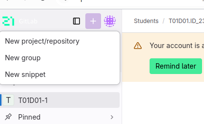
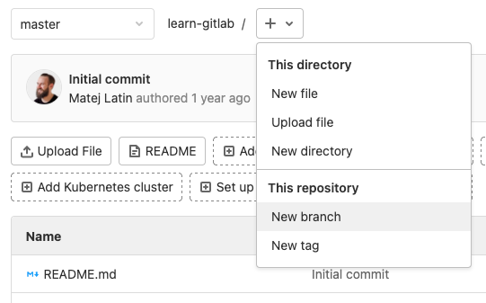
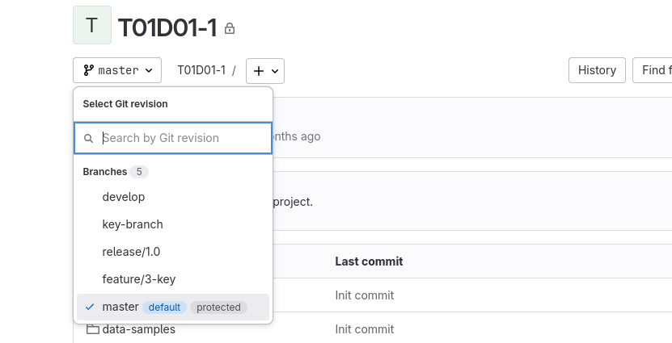
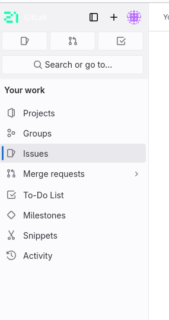
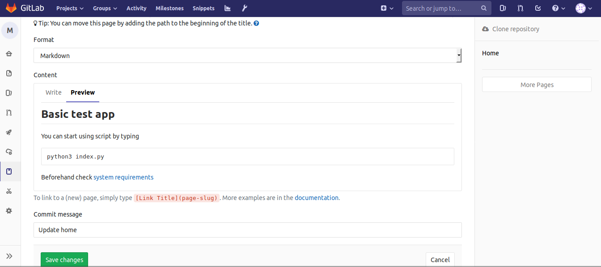

# Краткий мануал по работе с Gitlab

## Содержание

1. [Создание личного репозитория с нужным .gitignore и простым README.MD](#Создание-личного-репозитория-с-нужным-.gitignore-и-простым-README.MD) \
2. [Создание веток develop и master](#Создание-веток-develop-и-master) \
3. [Установка ветки develop по умолчанию](#chapter-iii) \
4. [Создание issue на создание текущего мануала](#chapter-iv) \
5. [Создание ветки по issue](#chapter-v) \
6. [Создание merge request по ветке в develop](#chapter-vi) \
7. [Комментирование и принятие реквеста](#chapter-vii) \
8. [Формирование стабильной версии в master с простановкой тега](#chapter-viii) \
9. [Работа с wiki проекта](#chapter-ix) \


# 1 Cоздание личного репозитория с нужным .gitignore и простым README.MD

## Cоздание личного репозитория

Чтобы воспользоваться репозиторием, нужно создать новый проект:

1. Кликаем по иконке со значком + в панели управления.
Кнопка создания нового репозитория в GitLab

2. Выбираем пункт New project/repository.
Пункт "Создать новый проект"

3. Затем кликаем по Create blank project.

4. Указываем его имя и другие запрашиваемые параметры (можно указать, публичным будет репо или приватным) и нажимаем на кнопку Create Project.



Вместе с проектом сформируется новый git-репозиторий. Теперь можно с ним взаимодействовать, то есть загружать файлы, делать коммиты, создавать различные ветки для разработки продукта и мерджить их при необходимости.

## Cоздание .gitignore

Git будет отслеживать изменения всех файлов и каталогов в заданной директории, однако некоторые из них мы предпочли бы игнорировать. Для этого нам нужно создать файл .gitignore в корневом каталоге репозитория. Открой редактор и создай новый файл со следующим содержанием:

.gitignore

```
*.pyc
*~
__pycache__
myvenv
db.sqlite3
/static
.DS_Store
И сохрани его как .gitignore в корневом каталоге "djangogirls".
```

## Cоздание README.MD

README.md оформляется с помощью языка разметки Markdown и отображается на странице профиля.
В этом файле может быть любая информация, которая будет полезна другим

# 2 Создание веток develop и master

Ветки – не уникальная для GitLab функция. Это часть git, поэтому, как и в случае с репозиториями, тут можно пойти тремя путями:



1. на сайте GitLab в окне управления репозиторием нажать на кнопку + справа от названия ветки, а потом выбрать пункт New branch в выпадающем меню.
Кнопка создания дополнительной ветки в GitLab

2. Можно создать новую ветку через git-клиент в терминале с помощью команды git checkout -b [название новой ветки].

3. Или воспользоваться аналогичной функций в используем графическом git-клиенте (Tower, Sublime Merge, GitFox и т.п.).

Любой из способов позволит создавать новую ветку, в которую после этого можно будет отправлять коммиты и делать пуши.

# 3 Установка ветки develop по умолчанию

Находясь на своей странице репозитория выбираем ветку develop



# 4 Создание issue на создание текущего мануала

В git-системах есть инструменты, помогающие оповещать разработчиков об ошибках и обсуждать их как с пользователями, так и с коллегами.

Речь идет о разделе Issues. Если возникла проблема, то нужно сообщить о ней тут. Для этого:

1. Открываем раздел Issues в боковой панели управления.

2. Затем нажимаем на кнопку New issue.
Кнопка создания нового issue

3. Даем имя обнаруженной проблеме, а затем подробно описываем ее в разделе Description.

4. Затем назначаем ответственного в пункте Assignee и срок, в течение которого нужно найти решение найденной проблемы.

5. А потом нажимаем на кнопку Create issue.



# 5 Создание ветки по issue

1. На Gitlub перейдите на главную страницу репозитория.

2. Под именем вашего репозитория нажмите Issues.

3. На горизонтальной панели навигации вкладка с надписью «Issues» обведена темно-оранжевым цветом.
В списке проблем щелкните проблему, для которой вы хотите создать ветку.

4. На правой боковой панели в разделе «Development» нажмите Create a branch. Если у проблемы уже есть связанная ветка или pull request, выберите и нажмите Create a branch.

5. Скриншот боковой панели проблем. В разделе «Development» ссылка с надписью «Create a branch» обведена темно-оранжевым цветом.
При желании в поле «Branch name» введите имя ветки.

6. При желании выберите раскрывающееся меню Repository destination, затем выберите репозиторий.

7. В разделе «What's next» выберите, хотите ли вы работать с веткой локально или открыть ветку в Gitlub Desktop.

8. Нажмите Create branch.

# 6 Создание merge request по ветке в develop

1. В разделе Merge Requests" нажмите на New Merge Request" для создания нового запроса на слияния одной ветки с другой.

2. Выберите ветку, из которой хотите добавить изменения (в нашем случае development). ...

3. Затем нажмите на кнопку "Compare branches and continue".

# 7 Комментирование и принятие реквеста

1. Под именем вашего репозитория нажмите «Запросы на извлечение».

2. В списке запросов на извлечение щелкните запрос на извлечение, в котором вы хотите оставить комментарии к строкам.

3. В запросе на извлечение щелкните «Файлы изменены».

4. Наведите указатель мыши на строку кода, в которую вы хотите добавить комментарий, и щелкните синий значок комментария.

5. При желании вы можете добавить комментарий к нескольким строкам. Вы можете щелкнуть номер первой строки, которую вы хотите прокомментировать, и перетащить вниз, чтобы выбрать диапазон строк, затем щелкнуть синий значок комментария на последней строке, которую вы хотите прокомментировать. В качестве альтернативы вы можете щелкнуть синий значок комментария рядом с первой строкой, которую вы хотите прокомментировать, а затем перетащить его вниз до последней строки, которую вы хотите прокомментировать.

6. В поле комментария введите свой комментарий.

7. При желании, чтобы предложить конкретное изменение строки или строк, щелкните , затем отредактируйте текст в блоке предложений.

8. Чтобы прокомментировать непосредственно файл, справа от файла щелкните и введите свой комментарий.

9. Когда вы закончите, щелкните Добавить одиночный комментарий.

# 8 Формирование стабильной версии в master с простановкой тега

Создайте тег первой версии

```
git tag v1
git log
```
Теги для предыдущих версий
Обозначим версию, предшествующую текущей, названием v1-beta. Прежде всего, мы переключимся на предыдущую версию. Вместо того чтобы искать хеш коммита, мы будем использовать обозначение ^, а именно v1^, указывающее на коммит, предшествующий v1.

Если обозначение v1^ вызывает у вас какие-то проблемы, попробуйте также v1~1, указывающее на ту же версию. Это обозначение можно определить как «первую версию, предшествующую v1».

```
git checkout v1^
cat hello.html
```

Переключение по имени тега
Теперь попробуйте попереключаться между двумя отмеченными версиями.

```
git checkout v1
git checkout v1-beta
```

Просмотр тегов с помощью команды tag
Вы можете увидеть, какие теги доступны, используя команду git tag.

```
git tag
```

# 9 Работа с wiki проекта

Gitlab wiki — документация, которую можно вести для каждого проекта. Обычно это системные требования, описание пакетов и процесса установки.

В документации может содержаться информация, которая необходима для поддержки системы и к которому будут обращаться технические специалисты, которые занимаются её поддержкой.


